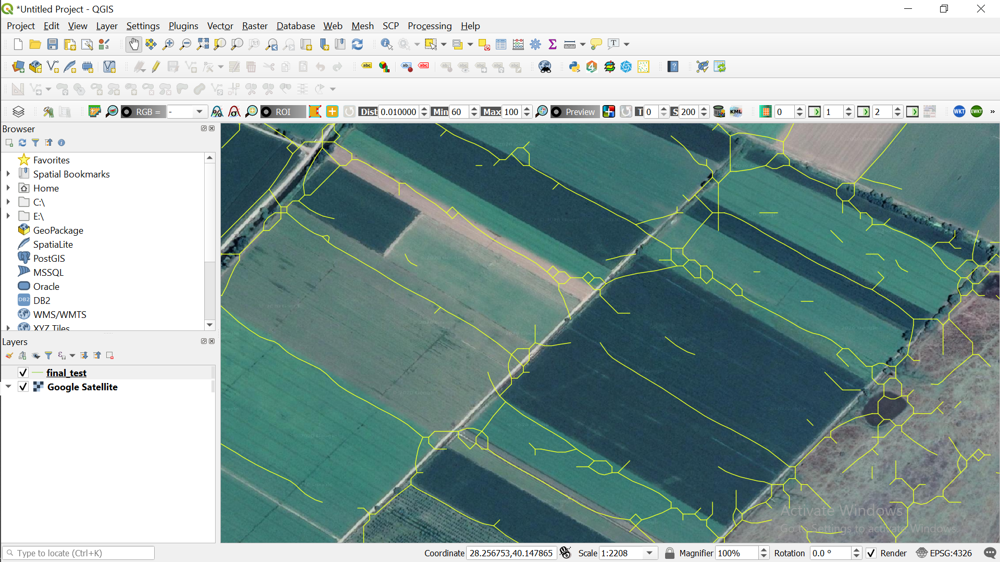

# BoundaryGEE

This is an attempt to translate raster processes of this great open-source [Reference Article](https://ieeexplore.ieee.org/document/8584043)
to Google Earth Engine.

Any contribution is highly appreciated.

*I'll add the details of the code.*

Click here: [GEE Link](https://code.earthengine.google.com/edb00d86ad7dded2391f29a40523a7c4)

Then click ```Run``` to see the preliminary results.

**Example Raster Output: (PRELIMINARY!)**

<div align="center"></div>

## Customization on Script
-	By adjusting **T** parameter, you can eliminate some noise (at Line 24)
-	Connected Component analysis could be improved to eliminate extra lines within the fields.
-	Rather than taking ‘mean’ of images in each month, you can choose one per month to reduce computational intensity.
-	Rather than taking ‘mean’ of images in each month, you can use median, mosaic, or qualityMosaic functions.
-	You can extend the time-series. I guess the method is particularly useful since it operates on time-series as if lower values of the boundaries show itself over time.
-	You can play with round standard deviation kernel (5x5 circle convolution right now.)
- You can also weight the bands as step 1 on page 239.

## Post-Processing
I cannot explain better than the authors of the article on page 241. I tried steps in QGIS-GRASS except step 7 (the authors use ArcGIS for this step. There should be an option in GRASS, but I took several errors.) **Pay particular attention to the output of each step!** I got some errors since one of the steps add an extra column to the meta-data. That error took one day to solve!

I attached an attempt as ScreenShots below. Small circles at the second SS prevented us from extending lines.

**Example Vector Outputs: (PRELIMINARY!)**

Vector Output              |  Vector Output (Zoomed in)
:-------------------------:|:-------------------------:
  |  
